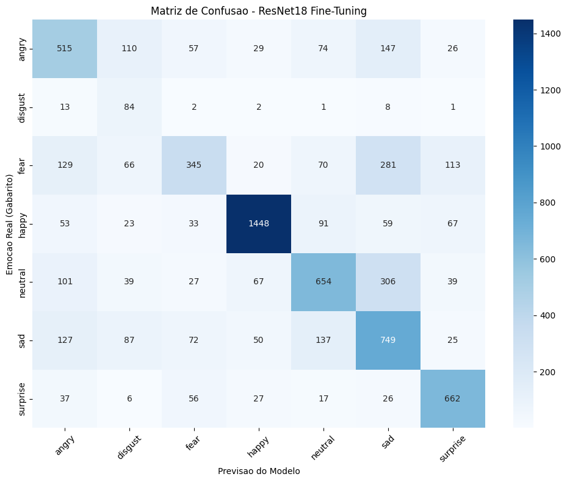

# 🎭 FER-2013 Facial Expression Recognition & FastAPI Inference

Um pipeline completo de Machine Learning, desde a experimentação com Deep Learning até o deploy de uma API RESTful, focado na classificação de emoções faciais utilizando o dataset FER-2013.

## 📌 O Projeto
O objetivo deste projeto foi construir um modelo robusto de Visão Computacional capaz de classificar 7 expressões faciais diferentes (Angry, Disgust, Fear, Happy, Sad, Surprise, Neutral). Além do treinamento, o projeto contempla o empacotamento do modelo em um backend moderno e assíncrono para inferência em tempo real.

## 🧠 Arquitetura e Decisões de Engenharia (IA)
Para lidar com os desafios do dataset (ruído e desbalanceamento extremo de classes), o pipeline de treinamento foi construído com as seguintes estratégias:

* **Transfer Learning & Fine-Tuning Cirúrgico:** Utilização da arquitetura `ResNet18` (pré-treinada no ImageNet), com descongelamento focado apenas nas camadas profundas (`layer3` e `layer4`) para adaptação a microexpressões faciais.
* **Differential Learning Rates:** Taxas de aprendizado customizadas por bloco de arquitetura (1e-5 para camadas profundas pré-treinadas, 1e-3 para a nova camada fully connected).
* **Prevenção de Data Leak:** Implementação de um Split Estratificado rigoroso separando a validação antes da aplicação de qualquer Data Augmentation.
* **Defesa em Profundidade contra Overfitting:** Combinação de `Dropout (p=0.5)`, Regularização L2 (`Weight Decay`), Data Augmentation dinâmico (Flip/Rotation) e Early Stopping manual (Model Checkpointing baseado na menor Validation Loss).
* **Weighted Cross Entropy:** Penalização matemática (Loss ponderada) para compensar o desbalanceamento das classes minoritárias (como *Disgust*).

## 🚀 Arquitetura de Software (Backend)
A API foi desenhada focando em manutenibilidade e separação de responsabilidades (Service Pattern):

* **FastAPI:** Framework assíncrono para rotas rápidas e documentação automática (Swagger/ReDoc).
* **Desacoplamento por Metadados:** O backend não possui variáveis de IA *hardcoded*. Parâmetros como nomes de classes, dimensões de entrada e médias de normalização são injetados dinamicamente via um arquivo `.json` salvo durante o treinamento, garantindo que a API não quebre caso a arquitetura do modelo mude no futuro.
* **Otimização de Memória:** O carregamento do `.pth` e do Grafo Computacional para a memória RAM/VRAM é feito exclusivamente no evento de `startup` do servidor.

## 📊 Resultados e Matriz de Confusão
* **Acurácia de Teste Atingida:** ~63% (Um salto significativo em relação à baseline inicial).


> **Nota sobre Limitações:** O modelo atual foi treinado em imagens de 48x48 focadas estritamente no rosto. Imagens não "croppadas" (com fundo ou corpo) reduzem drasticamente a precisão da rede. O próximo passo de arquitetura seria a implementação de um pipeline de detecção facial (ex: MTCNN) antes da camada de inferência.

---

## 🛠️ Como Executar o Projeto

### 1. Requisitos
* Python 3.10+
* (Opcional) Placa de vídeo compatível com CUDA para aceleração.

### 2. Instalação e Execução
Clone o repositório e ative seu ambiente virtual.

```bash
# Instale as dependências
pip install -r requirements.txt

# Inicie o servidor da API
uvicorn src.api:app --host 0.0.0.0 --port 8000 --reload